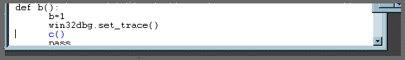
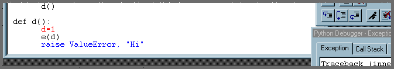

|logo| Pythonwin Debugger Tutorial
==================================

.. |logo|
   image:: ../pythonwin.gif
   :alt: Pythonwin logo

.. admonition:: Existing document
   
   :file:`\\Pythonwin\\doc\\debugger\\tutorial.html`

.. note::
   This debugger used to be known as the ``win32dbg`` package. Also, we have recently upgraded to a much better editor control. The screen shots in this tutorial do not reflect these recent changes. Although ``win32dbg`` will still work, you should substitute ``pywin.debugger`` for ``win32dbg`` in the screen-shots, and hopefully the new editor control will make the break-points etc even more obvious.

This tutorial shows how to debug a file provided with Pythonwin distribution. The module we will debug is called ```fail.py``, and is provided purely for demonstrating and testing the debugger. This file is located in the ``Pythonwin\pywin\debugger`` directory. 

This document does not attempt to discuss general debugging concepts. It is assumed that you understand the concepts of ``Step In`` to a routine, ``Step Over`` a routine, ``call stack``, ``break-point``, etc. 

When you have completed the tutorial, you should read the general debugger :doc:`documentation <documentation>`. 

In general, the user interface should be fairly intuitive. All toolbar items have status bar text and tool-tips, which will help determine their function. 

.. contents:: This tutorial covers the following topics: 
   :depth: 1
   :local: 

Preparation for the tutorial
----------------------------

To prepare for the tutorial, ensure you have Pythonwin installed, then start either Pythonwin/Python, Windows Explorer, or an "MS-DOS" prompt.

Starting the Debugger
---------------------

From :program:`Pythonwin` or :program:`python`:
~~~~~~~~~~~~~~~~~~~~~~~~~~~~~~~~~~~~~~~~~~~~~~~

At the interactive window, type:

   >>> import pywin.debugger.fail<enter>

From Windows Explorer:
~~~~~~~~~~~~~~~~~~~~~~

Navigate to the :file:`Pythonwin\\pywin\\debugger` directory, and double-click on the file :file:`fail.py`.

From the MS-DOS Prompt:
~~~~~~~~~~~~~~~~~~~~~~~

Change to the :file:`Pythonwin\\pywin\\debugger` directory.

For Windows NT users, type:

   :kbd:`fail.py<enter>`

Or Windows 95/98 (sob - you would hope that 98 would have fixed some of 95s dumbness!)

   :kbd:`<path to>\\python fail.py`

or

   :kbd:`start fail.py`

Using the Debugger
------------------

If all goes well, you should see the debugger appear in a full GUI frame, with a particular line in :file:`fail.py` highlighted. Part of the screen should look something like: 



.. note::
   This screen capture is wrong. Hopefully, what you can see on your screen is better and more obvious than this old picture!

In this case, the Python program has executed until it hit the statement :code:`pywin.debugger.set_trace()`.

This statement is effectively a hard-coded break-point, which creates a debugger, and causes it to stop at the statement following the :code:`set_trace()`. 

The Debugger is showing the blue line as the *current* line. This is the next statement to be executed. 

Setting a Break-point
---------------------

Our next step is to set a breakpoint somewhere inside the code that remains to be executed. As you can see, the Python program is about to call the function :code:`c()`. Examining the source, we can see that :code:`c()` calls :code:`d()`. The first line of :code:`d()` is a good spot!

To set a break-point, perform the following steps.

* Select the :file:`fail.py` source file (or more generally, you can open another source file, and set a break-point there).
* Scroll to the location where a breakpoint should be set, and ensure the carat (edit box cursor) is on the line.
* Either: Select the :guilabel:`Hand` icon on the debugger toolbar. Or: Select the :guilabel:`Breakpoints` property page, and select the :guilabel:`Add/Clear` button.

The debugger should then look something like:

.. image:: tutbp1.gif

Note the current line is still colored blue, and the newly added break-point is colored red. You can also select the :guilabel:`Breakpoints` property-page and see the breakpoint listed there.

We are now ready to run the debugger.

* Either: Select :guilabel:`Go` from one of the property-pages, or select the :guilabel:`Run` toolbar item.

The debugger should vanish briefly, then re-appear after hitting the breakpoint.

.. note::

   * The behaviour of the *hiding* can be changed, but with caveats - see the general debugger documentation for details on :any:`GUI versus Non-GUI Issues`).

   * The debugger will show the break-point line in blue - there will be no visual indication the line is *both* a break-point, *and* the current line. As soon as the current line moves off this line, it will return to its break-point color.

Stepping through the code
-------------------------

Use the :guilabel:`Step` toolbar or dialog button to step through code. Stepping from the current location will step over the assignment of :code:`1` to the local variable :samp:`{d}`. Continuing to step will step into the function :code:`e()`.

Examining the current context
-----------------------------

Just to jump in, we should have a play with the property pages. 

* Use the :guilabel:`Call Stack`` page to see the current context. Double-clicking will change the *current context*, and change the highlight. Expand and collapse each entry to view locals and globals.
* Use the :guilabel:`Interactive` page to view and change variables in the current context. For example, assuming that :code:`d()` is still the top call stack, entering :kbd:`d<enter>` into the interactive page will print :code:`1`. Almost any Python expression/statement can be executed here, from the current context. Use the :guilabel:`Call Stack` page to change the current context (i.e., make another stack entry blue), and notice how "d" is likely to evaluate to the function :code:`d()` (i.e., the interactive page has changed contexts).

Post-mortem diagnostics
-----------------------

The :file:`fail.py` as distributed is setup to demonstrate "port-mortem" debugging - i.e., debugging after an exception has occurred.

To demonstrate post-mortem diagnostics, simply:

* Click on the :guilabel:`Run` toolbar item or property page button

The debugger will again vanish, and re-appear looking something like:



Notice that there is now a new property page, titled "Exception". This shows the traceback that Python would normally print if this exception was unhandled.

All other features of the debugger work as expected. You can view each call stacks local and globals, etc. However, you can not force Python to ignore, or otherwise alter the normal Python exception processing. (except, or course, by stopping the debugger)

OK - now jump to the general debugger :doc:`documentation <documentation>` to get a more detailed picture.